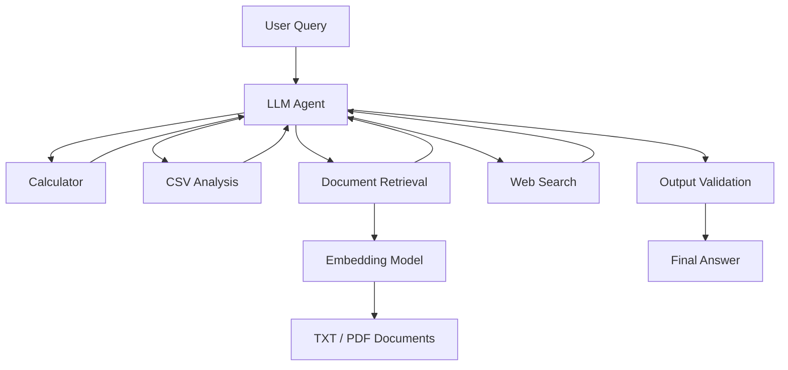

# AI Research & Data Analysis Agent

A Python-based LLM agent for autonomous research and data analysis. The system dynamically selects and executes tools for numerical calculations, CSV analysis, retrieval from local TXT/PDF documents, and current web research.

The project implements the core agent orchestration logic directly in Python rather than relying on a high-level agent framework.

## Features

* LLM-based autonomous tool selection
* Multi-step tool execution
* CSV inspection and statistical analysis
* Numerical calculations
* Retrieval-Augmented Generation (RAG)
* Semantic search using text embeddings
* TXT and PDF document support
* Source-aware PDF retrieval
* Current web search
* Structured agent state with Pydantic
* Tool execution traces
* Citation validation
* Automatic correction of missing document citations
* Retry handling for malformed model-generated tool calls
* Automated evaluation suite
* Unit tests with PyTest
* Logging and basic observability

## Architecture



## Agent Workflow

The agent operates in an iterative tool-calling loop.

1. The user query and available tool schemas are sent to the LLM.
2. The model decides whether a tool is required.
3. Tool arguments are generated as structured data.
4. The corresponding Python function is selected through a tool registry.
5. The tool is executed locally.
6. Its result is returned to the LLM.
7. The model can request additional tools or generate the final answer.
8. Document-based answers are validated for citations before being returned.

A maximum-step limit prevents uncontrolled agent loops.

## Tools

### Calculator

Performs arithmetic operations such as addition, subtraction, multiplication and division.

### CSV Inspection

Inspects CSV files and returns information such as:

* column names
* number of rows
* data types

### CSV Analysis

Performs statistical operations including:

* mean
* median
* minimum
* maximum
* descriptive summary

Column names are normalized to make tool usage more robust to variations such as `SNR` and `snr`.

### Document Search

Searches locally stored TXT and PDF documents using semantic similarity.

The system supports both collection-wide retrieval and retrieval restricted to a specific document.

### Web Search

Retrieves current public information when the user's question requires recent or external knowledge.

## Retrieval-Augmented Generation

Local documents are converted into overlapping text chunks.

Each chunk contains metadata including:

* source filename
* PDF page number when available
* globally unique chunk ID

The chunks are embedded using the `all-MiniLM-L6-v2` SentenceTransformer model.

For a query:

```text
User Query
    ↓
Query Embedding
    ↓
Cosine Similarity
    ↓
Top-k Chunks
    ↓
LLM Context
    ↓
Grounded Answer
```

A similarity threshold prevents unrelated local documents from being returned for irrelevant questions.

If the user explicitly names a document, retrieval can be restricted to that source.

## Source Grounding

Document-based answers must reference the retrieved source metadata.

TXT example:

```text
[Source: resnet.txt, Chunk: 17]
```

PDF example:

```text
[Source: research_paper.pdf, Page: 4, Chunk: 23]
```

The agent includes an output-validation step. If document retrieval was used but the final answer contains no citation, the model receives one automatic correction attempt.

The evaluation system additionally checks whether cited source/page/chunk combinations were actually retrieved.

## Structured Agent State

Pydantic models represent agent execution state.

`ToolExecution` stores:

```text
tool
arguments
result
success
error
```

`AgentTrace` stores:

```text
tools
tool_results
steps
```

`AgentResult` combines the final answer with the execution trace.

This allows agent behavior to be inspected independently from the final natural-language response.

## Error Handling

The agent handles:

* unknown tools
* tool execution exceptions
* malformed model-generated tool calls
* missing document citations
* unsupported or unreadable documents
* maximum agent-loop steps

Malformed tool-call responses can be retried instead of terminating the complete agent run.

## Evaluation

The project contains a custom evaluation suite covering three different system layers.

### Retrieval Evaluation

Measures:

* Top-1 retrieval accuracy
* Top-k retrieval accuracy
* rejection of irrelevant queries

### Tool Routing Evaluation

Measures:

* required-tool accuracy
* exact tool sequence accuracy
* unnecessary-tool usage

Repeated calls to the same tool can be normalized when evaluating routing decisions separately from tool-call efficiency.

### Citation Evaluation

Measures:

* citation presence
* expected source accuracy
* validity of cited chunks
* citation precision
* PDF page citation validity

Citation validation compares the model's citations with the chunks actually returned by the retrieval system.

## Example Multi-Step Trace

For:

```text
What is the mean SNR in data/experiment.csv multiplied by 2?
```

the expected reasoning workflow is:

```text
User
 ↓
analyze_csv
 ↓
mean SNR
 ↓
calculator
 ↓
multiply by 2
 ↓
final answer
```

The complete tool sequence and results can be inspected using:

```python
result = run_agent(
    query,
    return_trace=True,
)

print(result.answer)
print(result.trace.tools)
print(result.trace.tool_results)
```

## Project Structure

```text
ai-research-agent/
│
├── data/
│   ├── experiment.csv
│   └── documents/
│       ├── anomaly_detection.txt
│       ├── resnet.txt
│       └── research_paper.pdf
│
├── src/
│   └── research_agent/
│       ├── __init__.py
│       ├── agent.py
│       ├── evaluation.py
│       ├── logging_config.py
│       ├── models.py
│       ├── retrieval.py
│       ├── tools.py
│       └── web_search.py
│
├── tests/
│   ├── test_models.py
│   ├── test_retrieval.py
│   └── test_tools.py
│
├── .env
├── .gitignore
├── main.py
├── pyproject.toml
└── README.md
```

## Installation

Clone the repository and install the package in editable mode:

```bash
pip install -e .
```

Create a `.env` file containing:

```text
GROQ_API_KEY=your_api_key
```

The `.env` file must not be committed to version control.

## Usage

Run:

```bash
py main.py
```

Example:

```python
from research_agent.agent import run_agent

answer = run_agent(
    "According to the available documents, "
    "how can ResNet be used as a feature extractor?"
)

print(answer)
```

## Tests

Run the deterministic unit tests with:

```bash
pytest -v
```

Run the agent evaluation suite with:

```bash
py -m research_agent.evaluation
```

The unit tests cover deterministic Python components, while the evaluation suite measures end-to-end agent behavior involving the LLM.

## Technologies

Python, OpenAI-compatible API, Groq, Pydantic, Pandas, SentenceTransformers, scikit-learn, PyPDF and PyTest.

## Limitations

The current PDF pipeline extracts embedded text and therefore does not support scanned image-only PDFs requiring OCR.

The retrieval system uses an in-memory embedding index rather than a persistent vector database. This keeps the implementation transparent and is sufficient for the scale of the project.

LLM behavior is probabilistic. Consequently, end-to-end agent evaluations may show small variations between runs.

Citation validation confirms that cited chunks were retrieved, but does not prove that every generated statement is semantically entailed by the cited passage.

## Future Improvements

Possible extensions include persistent vector storage, hybrid retrieval, semantic faithfulness evaluation, conversation memory, asynchronous tool execution, or integration with an agent orchestration framework such as LangGraph.

These extensions were deliberately left outside the current scope to keep the implementation focused on the fundamental mechanisms of LLM agents.
